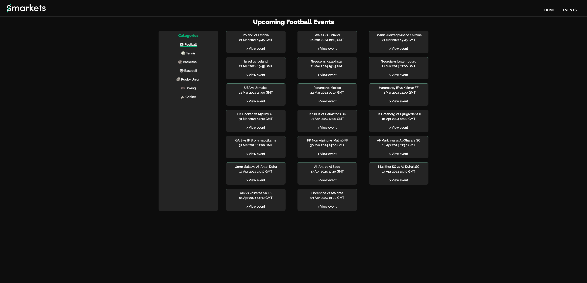
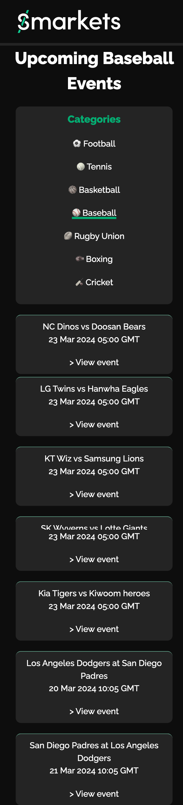

# Dear Smarkets

## Technical decisions

In this project I used the following technologies:

1. React - I selected it as I know Smarkets uses it and it was something I feel comfortable using too
2. Next (App router) - I selected it as I know Smarkets uses it and I wanted to stretch myself. Also NextJs became recently popular for a reason - it enables features like server-side rendering and static site generation, image optimization etc offering fast page loads and improved Core Web Vitals and as a result SEO.
3. Typescript - same as nr 1
4. For css I used css modules (I planned to use tailwind but changed my mind).
   CSS Modules enable us to use the same class name without conflicting in multiple files since each class name is assigned a distinct programmatic name. For large projects, React CSS Modules offer several advantages, including modularity, reusability, maintainability, scalability etc.
5. For testing I used jest and react testing library, I haven't had enough time to fully test the components but I picked two to show how I would go about it.
6. Making sure the website is mobile responsive.
7. Making sure the website is accessible (using semantic HTMl and aria tags when necessary and making sure all elements are tabbable)

## Project idea

I wanted to create something small that would give the feel of Smarkets branding, I used two APIs,
and picked few sports to choose from. You can view all upcoming events related to a specific sport from the sidebar and click on individual event to see more details.

## Images




## Next steps

- If I had more time I would implement more endpoints and display more information on the cards, due to the time limit I was only able to display limited information.
- I would implement pagination on the main category page using 'next' object.
- I would also add an option to select different state -> currently I am only showing upcoming events. I could display below the current categories sidebar.
- Tweak css styling
- I would add context or redux to have a global state.
- I would implement more testing and E2E.

## Getting Started

This is a [Next.js](https://nextjs.org/) project bootstrapped with [`create-next-app`](https://github.com/vercel/next.js/tree/canary/packages/create-next-app).

First, install dependencies:
npm i

First, run the development server:

```bash## Getting Started
## Getting Started

npm run dev
# or
yarn dev
# or
pnpm dev
# or
bun dev
```

Open [http://localhost:3000](http://localhost:3000) with your browser to see the result.

You can start editing the page by modifying `app/page.tsx`. The page auto-updates as you edit the file.

This project uses [`next/font`](https://nextjs.org/docs/basic-features/font-optimization) to automatically optimize and load Inter, a custom Google Font.

# Thank you for the opportunity
